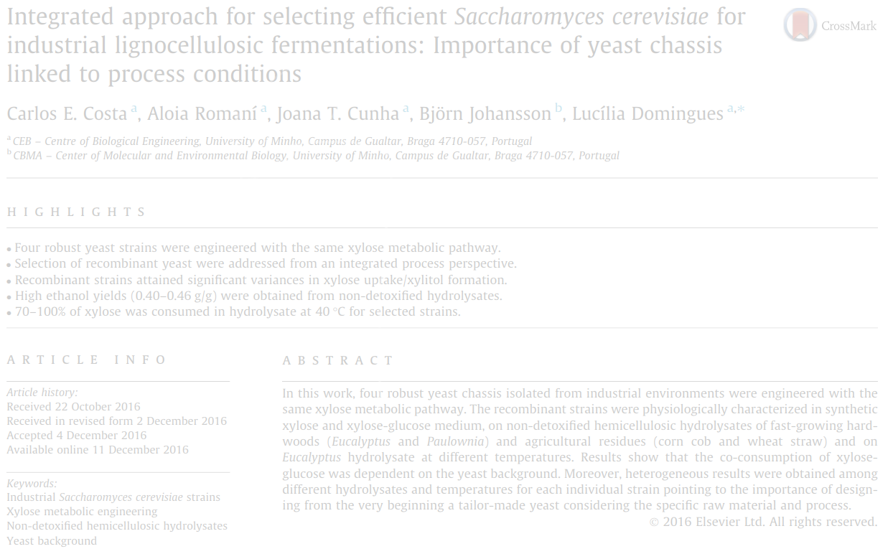

# [Lastname et al. 2020]

This repository contains Jupyter notebooks describing cloning using
[Python](https://www.python.org),
[Jupyter notebooks](https://jupyter.org) and
[pydna](https://github.com/BjornFJohansson/pydna).

The notebooks and other files in this repository accompany the publication:

Costa, C.E., Romaní, A., Cunha, J.T., Johansson, B., Domingues, L., 2017. Integrated approach for selecting efficient
Saccharomyces cerevisiae for industrial lignocellulosic fermentations: Importance of yeast chassis linked to process
conditions. Bioresour. Technol. 227, 24–34.
[pubmed](https://www.ncbi.nlm.nih.gov/pubmed/28013133)
[publisher](http://www.sciencedirect.com/science/article/pii/S0960852416316674)

The notebooks can be visualized in a number of ways.
Each notebook (.ipynb) is accompanied by a HTML file with the same name but with an (.html)
extension. These can be opened in a web browser without installing any software.

The notebooks (.ipynb) can be opened in the browser through the nbviewer service
[here](http://nbviewer.jupyter.org/github/MetabolicEngineeringGroupCBMA/Cunha_et_al_2017/blob/master/notebooks/index.ipynb)
or directly in Github [here](notebooks/index.ipynb).

[index](notebooks/index.ipynb)

[pMEC1049](notebooks/pMEC1049.ipynb)

[pMEC9001-2-3](notebooks/pMEC9001-2-3.ipynb)

The index.ipynb notebook is the place to start as it has links to the other notebooks.

Each notebook contain links (usually in the end) to the resulting sequences in Genbank flat file format.

These notebooks are tested on the github action build service.

This means that the notebook outputs are re-executed and compared with saved
results once per week to ensure [reproducibility](https://en.wikipedia.org/wiki/Replication_crisis).

If the badge below is green, all tests gave the expected results.

If you would like to have your own copy of this repository, the best solution is to get a
Github account and then make your own fork. If you would like to download all files to your
computer as a zip file, Click [here](https://github.com/BjornFJohansson/Cunha_et_al_2017/archive/master.zip)

Executing these notebooks require [pydna](https://github.com/BjornFJohansson/pydna) (version 3.1.1 or later)
and [pygenome](https://github.com/BjornFJohansson/pygenome) 3.1.0. or later.
