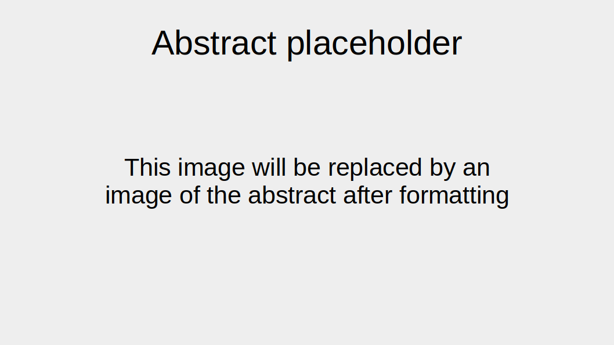

# Lastname et al. 2020

This repository contains Jupyter notebooks describing cloning using
[Python](https://www.python.org),
[Jupyter notebooks](https://jupyter.org) and
[pydna](https://github.com/BjornFJohansson/pydna).

The notebooks and other files in this repository accompany the publication:

**Adams, A. A., Ball, B, & Carter, C. C. (2000). An example of a placeholder reference. Journal of Examples, 23(4), 245-259.**

[PubMed](https://pubmed.ncbi.nlm.nih.gov/27328301)
[website](https://journals.plos.org/plosmedicine/article?id=10.1371/journal.pmed.1002049)

The notebooks can be visualized in a number of ways.

The notebooks (.ipynb) can be viewed directly on Github or through the
nbviewer service [here](http://nbviewer.jupyter.org)

The Jupyter Notebook Viewer for [chrome](https://chrome.google.com/webstore/detail/jupyter-notebook-viewer/ocabfdicbcamoonfhalkdojedklfcjmf?hl=en) is free and very useful to rapidly view notebooks in the browser.

## Significant files

[index](notebooks/index.ipynb)

[pMEC1049](notebooks/pMEC1049.ipynb)

[Pydna boilerplate code](notebooks/pydna.ipynb)

[nbval_examples](notebooks/nbval_examples.ipynb)

The index.ipynb notebook is the place to start as it has links to the other notebooks.

Each notebook contain links (usually in the end) to the resulting sequences in Genbank flat file format.

These notebooks are tested on the github action build service.

This means that the notebook outputs are re-executed and compared with saved
results once per week to ensure [reproducibility](https://en.wikipedia.org/wiki/Replication_crisis).

If the badge below is green, all tests gave the expected results.

## How to use this repository

This repository was made to facilitate reproducing Jupyter notebooks online in a GitHub repository.

1. Create a GitHub account if you do not already have one
2. Click on the  at the top of this screen to make you own copy

### Using Git

These steps **require** having [Git](https://git-scm.com) installed. This is the recommended way.

3. Clone the repository to you own computer.
4. Replace the notebooks in the `notebooks` folder with your notebooks and add *all* other files needed to run them
5. Run the notebooks using the `test_all_notebooks.sh` script
6. Add dependencies to the `environment.yml` if necessary
7. Commit and push

### Using GitHub

These steps do not require Git.

3. Run and save your notebooks on you local computer
4. Navigate to the `notebooks` folder in your repository
5. Use the `Addfile` -> `Upload files` button at the upper right corner to upload your notebooks and *all* other files needed to run them.
6. Edit the `environment.yml` if necessary. This can be done online.
7. Click on each original file that you do not want to have the option to delete them.

## Automatic testing

The notebooks are set up to be tested once per week by running the `test_all_notebooks.sh` script.
This can be changed in the `.github/workflows/test_notebooks_workflow.yml file`.

